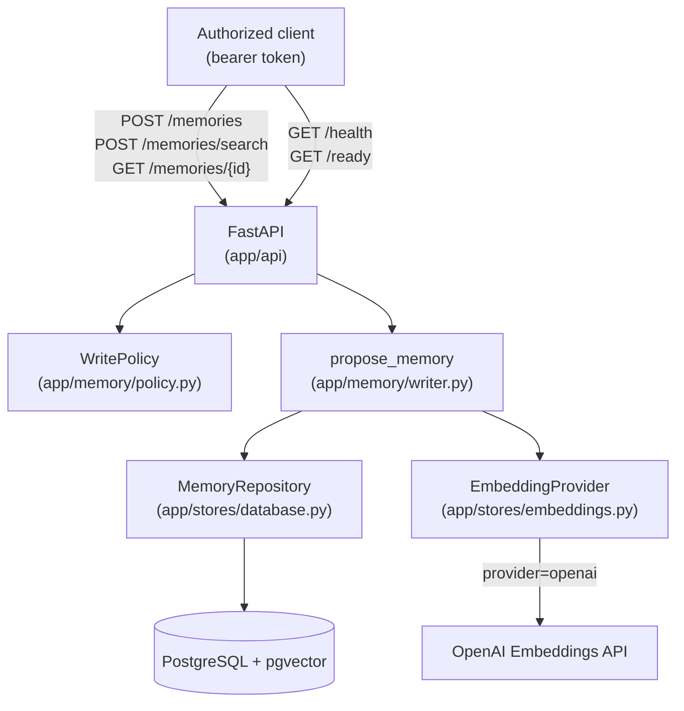

# Architecture

Read `docs/overview.md` first for what this service is and why it exists.
This document is the technical reference: request flow, the memory record
contract, the database schema, the policy model, and the error-handling
model.

## System boundary



`Policy`, `MemoryRepository`, and `EmbeddingProvider` are constructed once at
startup (`app/core/lifecycle.py`) and attached to `app.state`; routes reach
them through typed FastAPI dependencies (`app/api/dependencies.py`), never by
importing a global.

## Request flow

### Write: `POST /memories`

```text
MemoryCreateRequest (validated by Pydantic: field lengths, confidence 0..1)
  -> policy.validate_type(type)            # 422 policy_rejected if not in config/policy.yaml
  -> policy.validate_sensitivity(sensitivity)  # 422 policy_rejected if not in config/policy.yaml
  -> server assigns memory_id ("mem_" + uuid4 hex), created_at (UTC now)
  -> write_status = policy.resolve_write_status(sensitivity)
       # "pending_approval" if sensitivity in require_approval, else "approved"
  -> embeddings.embed(content)             # 503 embedding_unavailable on failure
  -> repository.create(record, embedding)  # 503 storage_unavailable on failure
  -> 201 MemoryRecord
```

This is the entire write path (`app/memory/writer.py:propose_memory`). There
is no code path that stores a record without going through policy
validation first — see `AGENTS.md`.

### Read: `GET /memories/{memory_id}`

Requires `tenant_id` and `project_id` as query parameters. Both the Postgres
and in-memory repository implementations filter on scope *before* returning
a row, so a caller cannot distinguish "wrong scope" from "doesn't exist" —
both return `404 not_found`. This is deliberate: it avoids leaking whether a
`memory_id` exists under a scope the caller isn't authorized for.

### Search: `POST /memories/search`

```text
MemorySearchRequest (scope required; query 1-2000 chars; top_k 1-50)
  -> embeddings.embed(query)                       # 503 embedding_unavailable
  -> repository.search(scope, embedding, top_k,
                        types, include_pending)     # 503 storage_unavailable
  -> ranked [{memory, score}], highest similarity first
```

`search` always filters by `tenant_id`/`project_id` (and `user_id`/`agent_id`
when present in the scope), and by `write_status='approved'` unless the
caller sets `include_pending: true`. Expired records
(`expires_at <= now()`) are excluded unconditionally — there is no
`include_expired` override.

## The memory record contract

Matches `plan.md`'s proposed contract. Defined in `app/memory/models.py`:

```yaml
memory_id: mem_<uuid4 hex>        # server-assigned
type: preference                  # validated against config/policy.yaml
scope:
  tenant_id: home                 # required
  project_id: henley               # required
  user_id: null                    # optional filter/tag
  agent_id: null                   # optional filter/tag
content: "..."                     # 1-8000 chars
provenance:
  source_type: agent_run           # required
  run_id: run_123                  # optional
  source_id: null                  # optional
confidence: 0.92                   # 0.0-1.0, caller-supplied
created_at: 2026-08-08T18:42:27Z   # server-assigned
expires_at: null                   # optional; excluded from search once past
supersedes: null                   # accepted, stored, NOT acted on (Phase C)
sensitivity: internal              # validated against config/policy.yaml
write_status: approved             # server-resolved: approved | pending_approval
```

`supersedes` is intentionally inert right now: the field is accepted and
stored for forward compatibility, but nothing in this service marks another
record superseded. Don't rely on it until Phase C ships.

## Database schema

`app/stores/database.py:schema_sql()` — applied idempotently
(`CREATE ... IF NOT EXISTS`) at startup:

```sql
CREATE EXTENSION IF NOT EXISTS vector;

CREATE TABLE IF NOT EXISTS memories (
  memory_id text PRIMARY KEY,
  type text NOT NULL,
  tenant_id text NOT NULL,
  project_id text NOT NULL,
  user_id text,
  agent_id text,
  content text NOT NULL,
  source_type text NOT NULL,
  run_id text,
  source_id text,
  confidence double precision NOT NULL CHECK (confidence >= 0 AND confidence <= 1),
  created_at timestamptz NOT NULL,
  expires_at timestamptz,
  supersedes text,
  sensitivity text NOT NULL,
  write_status text NOT NULL,
  embedding vector(N) NOT NULL   -- N = MEMORY_EMBEDDING_DIMENSIONS, default 1536
);

CREATE INDEX ... ON memories (tenant_id, project_id, agent_id);
CREATE INDEX ... ON memories USING hnsw (embedding vector_cosine_ops);
```

One flat table, no joins. `embedding <=> query_vector` (pgvector's cosine
distance operator) drives ranking; the API converts distance to a
`1.0 - distance` similarity score so higher is always better, matching
`InMemoryMemoryRepository`'s cosine similarity so both implementations rank
identically (see `_cosine_similarity` in `app/stores/database.py`).

Changing `MEMORY_EMBEDDING_DIMENSIONS` after records already exist requires
a migration (the column width is fixed at creation); there is no automatic
re-embedding path.

## Storage and embedding abstractions

Both are `typing.Protocol`s so the concrete backend can change without
touching the API or policy layers:

- **`MemoryRepository`** (`app/stores/database.py`): `PostgresMemoryRepository`
  (real) and `InMemoryMemoryRepository` (deterministic, in-process — used by
  the entire unit test suite, no Docker required). `plan.md` calls out Qdrant
  as a plausible future implementation if pgvector's retrieval capability
  becomes limiting.
- **`EmbeddingProvider`** (`app/stores/embeddings.py`): `OpenAIEmbeddingProvider`
  (real semantic embeddings, requires `OPENAI_API_KEY`) and
  `DeterministicEmbeddingProvider` (a SHA-256-hash-based pseudo-embedding —
  reproducible and network-free, but **not semantic**; it exercises the
  storage/ranking code paths, not retrieval quality). The provider is
  selected by `MEMORY_EMBEDDING_PROVIDER` and constructed once at startup in
  `app/core/lifecycle.py:_build_embedding_provider`.

## Policy model

`config/policy.yaml` is loaded once at startup (`app/memory/policy.py`) into
a frozen `WritePolicy`:

```yaml
long_term:
  write:
    allowed_types: [preference, fact, decision, workflow_lesson]
    allowed_sensitivities: [public, internal, sensitive, identity, security]
    require_approval: [sensitive, identity, security]
```

`load_write_policy` cross-validates the file at load time (every
`require_approval` entry must also be an `allowed_sensitivities` entry) and
raises `PolicyConfigError` — with a specific reason — on a missing file,
unreadable file, invalid YAML, or an inconsistent policy. A malformed policy
fails application startup rather than silently accepting every memory type.

To add a new memory type or sensitivity tier: edit `config/policy.yaml`,
redeploy (`make up` rebuilds and restarts the `api` service; the file is
bind-mounted read-only, so no image rebuild is strictly required, but
restarting picks it up cleanly). No code change is needed.

## Error handling model

Every external I/O call (Postgres, the OpenAI embeddings API) is wrapped so
a backend failure becomes a **safe, bounded** response instead of an
unhandled `500` or a hung connection:

| Failure | Raised as | Route response |
| --- | --- | --- |
| `type`/`sensitivity` not in policy | `MemoryValidationError` | `422 policy_rejected` |
| Postgres unreachable/query failure | `MemoryRepositoryError` | `503 storage_unavailable` |
| OpenAI embeddings unreachable/malformed response | `EmbeddingProviderError` | `503 embedding_unavailable` |
| Bad/missing bearer token | (raised directly by `authorize`) | `401 unauthorized` |
| Unknown `memory_id` (or wrong scope) | — | `404 not_found` |

`MemoryRepositoryError` and `EmbeddingProviderError` messages are always
generic and safe — the real driver/HTTP exception is logged server-side
(`logger.exception(...)`) and chained (`raise ... from exc`) for local
tracebacks, but never included in the message returned to callers. This
matters because raw psycopg/httpx exception text can otherwise echo back
connection or upstream details.

Postgres connections use a bounded `connect_timeout` (5s) and
`statement_timeout` (10s) (`app/stores/database.py`). Without these, a down
or unresponsive Postgres hangs a request indefinitely instead of failing
into the `503` path above — this was an actual bug caught by testing against
the real Compose deployment; see `docs/troubleshooting.md`.

`/ready` never raises: `MemoryRepository.health()` catches its own errors
and returns `False`, so a database outage shows up as `503 {"status":
"not_ready", "database": false}`, not a crash of the readiness check itself.

## Security notes

- Every route except `/health` and `/ready` requires
  `Authorization: Bearer <MEMORY_API_TOKEN>`, checked with
  `secrets.compare_digest` (`app/security/auth.py`).
- The Postgres container is never published to the host or LAN — only the
  `api` service reaches it, over the internal Compose network
  (`compose.yaml`).
- The `api` container runs as a non-root UID (`10001`), with a read-only root
  filesystem, all capabilities dropped, and `no-new-privileges` — verified
  live in CI (`.github/workflows/ci.yml`), not just declared in Compose.
- `config/policy.yaml` decides what an agent may write and at what
  sensitivity; nothing in this service lets a caller (or an LLM) choose its
  own ACL or scope beyond the `tenant_id`/`project_id`/`user_id`/`agent_id`
  it authenticates as. Enforcing *who* may authenticate as which tenant/agent
  is outside this repository's boundary today — see `AGENTS.md`.
