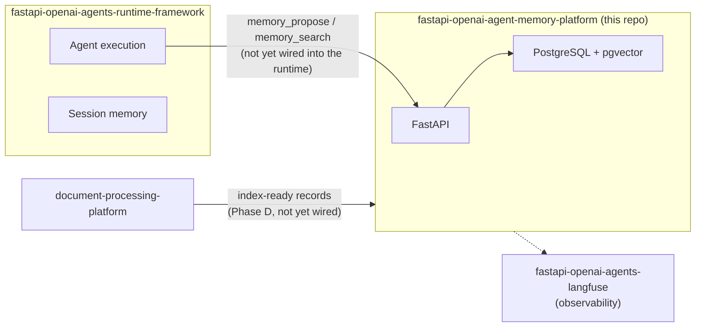

# Overview

## What this repository is

`fastapi-openai-agent-memory-platform` is the fourth service in the
HomeAIassistant platform: a stateful FastAPI service that stores long-term
agent memory and serves scoped semantic search over it, backed by
PostgreSQL + pgvector.

It exists because "memory" is not one thing. `plan.md` (kept at the
repository root as the source design document) identifies four distinct
concerns and gives each one an owner:

| Concern | Owner | Lifetime |
| --- | --- | --- |
| Runtime/control state (idempotency, approvals, audit) | `fastapi-openai-agents-runtime-framework` | One run |
| Conversation/session memory (per-turn chat history) | `fastapi-openai-agents-runtime-framework` (Agents SDK `Session`) | One session |
| Document parsing, chunking | `document-processing-platform` | Immutable, content-addressed |
| **Long-term memory + semantic retrieval** | **this repository** | Survives sessions, restarts, workflow changes — potentially years |

Collapsing these into one database (for example, adding a `memories` table to
the runtime's `RuntimeStore`) would mix trust and lifecycle boundaries that
are deliberately kept separate. See `plan.md`'s "What The Current Repositories
Tell Us" and "What I Would Not Do" sections for the full reasoning.

## Where this fits in the platform

The dashed and "not yet wired" edges above are deliberate: this repository is
a standalone, independently testable service today. Runtime-side tool
integration (`memory_search`, `memory_propose`, `knowledge_search`) and
document-processing ingestion are later phases (see below), not missing
glue code in this repo.

## Current phase: B — service skeleton

`plan.md` lays out six phases (A-F). This repository currently implements
**Phase B**:

- FastAPI service, bearer authentication, `/health`, `/ready`.
- PostgreSQL + pgvector storage, scoped by `tenant_id`/`project_id`/`user_id`/`agent_id`.
- The memory record contract (`type`, `scope`, `content`, `provenance`,
  `confidence`, `lifecycle`, `policy`) from `plan.md`.
- A deterministic write path (`POST /memories`): validate -> policy (`type`
  and `sensitivity` against `config/policy.yaml`) -> embed -> store. There is
  no unrestricted `remember(anything)` tool.
- A scoped vector search path (`POST /memories/search`) that excludes
  `pending_approval` records by default.
- A pluggable `EmbeddingProvider` (deterministic offline provider for
  dev/CI, OpenAI provider for real semantic search) and a pluggable
  `MemoryRepository` (Postgres, or in-memory for tests).
- Error handling that turns storage/embedding-provider failures into a
  bounded, safe `503` instead of an unhandled `500` or a hung request.

See `docs/architecture.md` for how these pieces fit together.

### Not yet implemented

Phase B deliberately stops short of:

| Phase | Adds |
| --- | --- |
| C — Long-term memory | Deduplication, supersession, expiration sweeps, deletion, memory audit trail |
| D — RAG | Ingestion from `document-processing-platform`'s index-ready records |
| E — Retrieval quality | Lexical/hybrid search, reranking, score thresholds, citations |
| F — Memory intelligence | Episodic-to-semantic consolidation, contradiction detection, decay, automatic candidate extraction |

None of Phase C-F is silently half-built; the write and search paths only do
what's described above. See `AGENTS.md` for the standing rules that keep it
that way (for example: no autonomous memory generation, no LLM-decided ACLs).

## Key concepts

**Memory vs. knowledge.** A *memory* is agent-generated (a preference, a
decision, a workflow lesson). *Knowledge* is externally sourced (a document,
an email, board minutes). Both will eventually share this service's
retrieval infrastructure, but they remain distinguishable record types —
this repository does not conflate "the agent said X" with "the source
document said X."

**Scope.** Every record and every search is scoped by `tenant_id` and
`project_id` (and optionally `user_id`/`agent_id`). There is no endpoint that
reads or searches across scopes implicitly — see `docs/architecture.md`.

**Policy, not code, defines what's writable.** `type` and `sensitivity` are
validated against `config/policy.yaml`, not a hardcoded enum. Adding a new
memory type is a config change, not a code change.

**Approval gate.** Sensitivities listed in `policy.long_term.write.require_approval`
land as `write_status=pending_approval` and are excluded from search unless a
caller explicitly opts in with `include_pending=true`. No component in this
service currently changes a `pending_approval` record's status — an approval
workflow is Phase C work.

## Where to go next

- New to this repo? Read this document, then `docs/architecture.md`.
- Setting it up or deploying it? `docs/instructions.md`.
- Calling the API? `docs/api-examples.md`.
- Something failing? `docs/troubleshooting.md`.
- Running Make targets? `docs/make-commands.md`.
- Full document index: `docs/README.md`.
